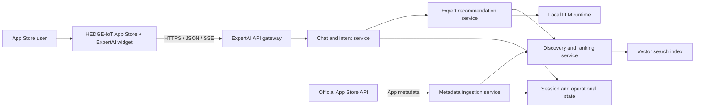

# D2.1 — System Architecture Specification

**Project:** HEDGE-ExpertAI — Context-Aware AI Discovery and Recommendation Assistant for the HEDGE-IoT App Store
**Beneficiary:** A Arti Mühendislik
**Task:** T2 — System Design and Core AI Development
**Nature:** Report
**Dissemination level:** Internal for Project Consortium
**Version:** 1.0
**Date:** 12 July 2026
**Status:** For consortium review and approval

## Document control

| Item | Value |
|---|---|
| Deliverable identifier | D2.1 |
| Deliverable title | System Architecture Specification |
| Primary task | T2 |
| Related milestone | M1 — Project Setup and Architecture Approval |
| Controlling source | Approved HEDGE-ExpertAI proposal |
| Approval state | Not yet approved |

## 1. Purpose and scope

This document defines the architecture baseline for HEDGE-ExpertAI. It translates the approved proposal into implementable system boundaries, services, data flows, interfaces, security controls, deployment assumptions, KPI measurement points, and integration decisions.

The specification covers the assistant, App Store integration boundary, metadata ingestion, search and ranking, recommendation and explanation, user-interface plug-in, supporting data stores, deployment topology, and operational controls. It does not claim that the system has been integrated with or validated on the HEDGE-IoT sandbox; those activities belong to subsequent implementation and validation work.

## 2. Architecture drivers

### 2.1 Functional drivers

| ID | Proposal-derived requirement |
|---|---|
| FR-01 | Accept natural-language requests and return relevant App suggestions with concise, source-grounded explanations. |
| FR-02 | Collect and index App metadata from the official App Store API on a periodic basis. |
| FR-03 | Combine lexical and semantic retrieval, using SAREF-aligned metadata as an optional signal where available. |
| FR-04 | Use an expert LLM layer to improve recommendation explanations while grounding output in source metadata. |
| FR-05 | Provide a plug-in compatible with the HEDGE-IoT App Store front end. |
| FR-06 | Expose integration endpoints through OpenAPI-documented services. |
| FR-07 | Detect new or changed catalogue entries and update the searchable index. |
| FR-08 | Support multi-turn session continuity and recommendation feedback required for later validation. |

### 2.2 Quality and operational drivers

| ID | Proposal-derived requirement |
|---|---|
| NFR-01 | At least 70% of pilot queries receive a relevant App within the first two suggestions. |
| NFR-02 | Response time is below 5 seconds under the acceptance definition agreed with the HEDGE-IoT team. |
| NFR-03 | New or changed catalogue entries become searchable within the committed freshness window. |
| NFR-04 | Components are containerized, documented, reproducible, and released under a permissive open-source licence. |
| NFR-05 | Only public App metadata and user-initiated queries are processed; privacy and log-retention controls are enforced. |
| NFR-06 | Service boundaries support independent testing, replacement, scaling, and integration. |
| NFR-07 | Core functionality is covered by automated unit and integration testing, with the proposal target of at least 80% coverage. |
| NFR-08 | Recommendations are explainable and restricted to available source metadata. |

## 3. System context

The solution spans two principal environments:

1. **HEDGE-IoT App Store environment** — hosts the catalogue, user experience, identity context, and official application metadata API.
2. **HEDGE-ExpertAI environment** — hosts the assistant services, indexes, model runtime, operational data, and integration gateway.



### 3.1 Trust boundaries

- The public or App Store-facing boundary terminates at the gateway.
- Internal services communicate on a private container network.
- The official App Store API is an external trusted data source whose authentication and schema must be confirmed.
- The LLM receives the user query and selected public App metadata required to produce an explanation.
- Redis contains transient session and operational data and is not exposed publicly.

## 4. Logical architecture

| Component | Responsibility | Principal interfaces | Persistent or operational state |
|---|---|---|---|
| App Store widget | Collect user requests, stream results, render App cards, submit feedback | Gateway chat and feedback APIs | Browser session identifier |
| API gateway | Single integration endpoint, routing, CORS, rate limiting, request IDs, optional authentication and authorization | HTTPS REST/SSE; internal HTTP | In-memory rate-limit state |
| Chat and intent | Intent/entity processing, session continuity, routing, response assembly | Gateway; recommendation and discovery services | Redis-backed session state |
| Expert recommendation | Retrieve candidates, construct grounded prompts, invoke the LLM, enforce ranking-consistent fallback | Chat service; discovery service; LLM runtime | No authoritative catalogue state |
| Discovery and ranking | Index App metadata; semantic retrieval; lexical scoring; optional SAREF boost; ranked result production | Recommendation, gateway, ingestion | Qdrant collection and in-process caches |
| Metadata ingestion | Periodic catalogue retrieval, normalization, checksum comparison, update submission, retry | Official or mock App Store API; discovery service; Redis | Checksums, last-run time, ingestion statistics |
| LLM runtime | Generate concise recommendation explanations from supplied context | Recommendation service | Model files and runtime cache |
| Qdrant | Store vectors and App metadata payloads | Discovery service | Search collection |
| Redis/Celery | Task queue, scheduler, checksums, sessions, feedback counters | Ingestion and chat services | TTL-controlled and aggregate operational records |
| Mock App Store API | Provide a contract-controlled catalogue while official sandbox access is unavailable | Ingestion and internal validation tools | Static development dataset |

## 5. Principal flows

### 5.1 Conversational discovery

1. The user submits a natural-language request through the widget.
2. The gateway validates and routes the request to the chat and intent service.
3. The chat service classifies intent and extracts available entities.
4. Discovery requests are sent to the recommendation service.
5. The recommendation service requests ranked candidates from discovery and ranking.
6. Discovery and ranking performs semantic retrieval, lexical scoring, and an optional SAREF-aligned boost.
7. The recommendation service supplies the query and returned App metadata to the LLM.
8. The response and ranked App cards are returned as JSON or streamed with server-sent events.
9. Session context and permitted operational events are recorded according to retention rules.

### 5.2 Catalogue ingestion and update

1. Celery Beat triggers ingestion at the configured interval; the current local default is 7,200 seconds.
2. The ingestion service retrieves paginated App metadata from the configured source.
3. Source fields are normalized into the internal metadata representation.
4. A checksum is compared with the stored value to identify new or changed entries.
5. Changed records are submitted in a batch to discovery and ranking.
6. Text representations and embeddings are generated and upserted into Qdrant.
7. Search caches are invalidated and operational ingestion statistics are updated.

Deletion handling, webhook/event handling, and authoritative timestamp behavior depend on the official HEDGE App Store contract and must be baselined before sandbox validation.

### 5.3 Feedback and validation

The widget can submit click, accept, or dismiss actions against a recommended App. Aggregate counters support the later recommendation-acceptance KPI. The exact consent, retention, anonymization, and acceptance-rate definition must be agreed before pilot data collection.

## 6. Data architecture

### 6.1 Canonical App metadata

The internal representation supports:

- stable App identifier;
- title and description;
- tags or keywords;
- optional SAREF-aligned type/category;
- input and output dataset descriptors;
- version and publisher;
- creation and update timestamps.

The adapter accepts a small set of conventional alternative field names, but this is not evidence of compatibility with the official API. A contract test must be created from the official schema.

### 6.2 Search representation

The searchable representation combines title, description, tags, publisher, and the optional SAREF-aligned value. A MiniLM sentence-transformer model produces dense vectors stored in Qdrant. Candidate results are rescored using lexical evidence and the optional SAREF signal.

The current reference weighting is:

```text
combined score = 0.6 × semantic score
               + 0.3 × lexical score
               + 0.1 × SAREF-aligned match signal
```

Weights and thresholds are configuration/design baselines and remain subject to validation on the jointly agreed HEDGE query set.

### 6.3 Session and operational data

- Active conversation history has a 30-minute TTL in the reference implementation.
- Per-session feedback entries have a 24-hour TTL.
- Recorded validation-session event lists have a 7-day TTL.
- Aggregate feedback counters persist until explicitly managed.
- Ingestion checksums have a 7-day TTL; last-run and aggregate ingestion statistics are retained operationally.

Before pilot operation, retention, deletion, anonymization, access control, and lawful data-handling rules must be approved. User-entered text may contain personal data even when the intended use case does not require it; the production design must therefore minimize collection and prevent sensitive content from entering logs.

## 7. SAREF alignment

The proposal treats SAREF-aligned metadata as an optional ranking signal rather than a hard dependency. The target architecture applies that principle in three stages:

1. use an explicit App Store value when one is supplied;
2. otherwise infer a coarse domain category from available metadata as a fallback;
3. apply a bounded ranking boost only when the query and App signals align.

The current fallback categories cover Energy, Building, Environment, Water, Agriculture, City, Health, and Manufacturing. These are internal retrieval categories aligned with SAREF-related domains; they must not be represented as authoritative SAREF classes or URIs unless confirmed by the official metadata contract.

In the reference implementation, the ranking endpoint can apply the bounded boost when a query category is supplied and the indexed App has a matching `saref_type` value. Automatic assignment of a missing App category and propagation of the extracted query category across the complete chat-to-recommendation flow are not yet wired end to end. Those items remain implementation work and are not treated as completed by this architecture document.

The HEDGE-IoT team should confirm:

- whether the catalogue exposes SAREF URIs, labels, properties, extension terms, or another vocabulary;
- which values are publisher-supplied versus inferred;
- whether multiple SAREF concepts can be attached to one App;
- whether inference is permitted and how inferred values must be identified;
- whether URI-level validation or RDF export is required.

## 8. Dialogue and LLM architecture

### 8.1 Intent and entity processing

The proposal identifies RASA as the dialogue framework. The target architecture therefore supports RASA-first classification and entity extraction, with a deterministic classifier as a low-resource or failure fallback. RASA is packaged as an optional deployment profile in the current reference implementation.

The acceptance deployment should enable and train RASA against the agreed domain vocabulary unless the consortium approves an equivalent intent component. The current RASA training material is English; multilingual support claimed in the proposal requires additional language data, pipeline decisions, and validation.

The current RASA package provides NLU training for intent classification and App-ID entity extraction but does not define RASA dialogue policies. Multi-turn history is currently maintained by the chat service in Redis. The consortium should confirm whether this separation satisfies the intended “RASA for dialogue management” commitment or whether RASA Core dialogue policies are required.

### 8.2 Grounded recommendation generation

The recommendation service builds the LLM context from ranked App metadata. Prompts instruct the model to use only supplied catalogue evidence and to produce concise explanations. If generation fails, a deterministic response is returned. If a generated ranking claim contradicts the returned order, a deterministic ranking-consistent fallback can be used.

The proposal's wider “HEDGE Expert Corpus” is not yet a separately versioned corpus in the audited implementation. Corpus composition, licensing, provenance, update rules, and evaluation must be defined before Objective 4 is considered complete.

## 9. External interfaces

### 9.1 App Store metadata API

The integration adapter currently assumes:

- a list endpoint and App detail endpoint;
- page and page-size pagination;
- JSON list or envelope responses;
- stable App identifiers;
- conventional metadata fields.

The following contract items remain open: base URL, authentication, endpoint paths, pagination model, rate limits, error model, deletion/tombstone events, webhook support, schema versioning, and exact SAREF representation.

### 9.2 App Store front end

The reference plug-in is delivered as standalone JavaScript and CSS assets and communicates with the gateway by REST and SSE. Final compatibility depends on HEDGE decisions for hosting, CSP, CORS, identity propagation, design system, localization, navigation, accessibility, analytics, and feedback consent.

### 9.3 Service APIs

FastAPI services expose machine-readable OpenAPI descriptions. Static OpenAPI JSON exports are maintained for gateway, chat/intent, recommendation, discovery/ranking, metadata ingestion, and the development mock API. Exports must be regenerated and contract-tested as part of release preparation.

## 10. Deployment architecture

### 10.1 Local and sandbox topology

The reference topology uses Docker Compose and a private network. Core runtime components are:

- gateway;
- chat/intent;
- expert recommendation;
- discovery/ranking;
- metadata ingestion worker, scheduler, and API;
- Ollama model runtime;
- Qdrant;
- Redis;
- development-only mock App Store API.

Optional profiles provide RASA, an nginx TLS edge, and a Keycloak-based authentication environment. Optional availability in configuration is not equivalent to production validation.

### 10.2 Portability and scale

Services are stateless where practical and keep authoritative operational state in Qdrant or Redis. This supports later deployment to a container orchestrator. Kubernetes manifests, high-availability configuration, backup/restore verification, horizontal-scaling tests, and production capacity tests remain later deployment work.

## 11. Security and privacy architecture

### 11.1 Implemented architectural controls

- centralized gateway boundary;
- configurable CORS;
- request identifiers;
- rate limiting;
- security response headers;
- optional API-key authentication;
- optional JWT validation and role checks for administrative and analytics operations;
- loopback binding for directly published internal-service ports in the reference Compose topology;
- optional TLS termination profile.

### 11.2 Controls requiring target-environment validation

- HEDGE identity-provider integration and token claims;
- TLS certificate ownership and renewal;
- production CORS and CSP values;
- mandatory RBAC activation and role mapping;
- key rotation;
- log anonymization and retention enforcement;
- container non-root operation, read-only filesystems, and image scanning;
- backup, recovery, security monitoring, and vulnerability management;
- DPIA determination if processing scope changes.

No production-security or GDPR-compliance claim is made until these controls are configured and verified in the target environment.

## 12. Availability and failure handling

- Health endpoints support dependency visibility.
- Celery provides retry and scheduled execution for ingestion.
- Ingestion uses checksums to avoid unnecessary re-indexing.
- The intent layer can fall back if RASA is unavailable or below confidence threshold.
- The recommendation layer provides deterministic output if LLM generation fails.
- The gateway reports unavailable upstream services with controlled error responses.
- Search caches are cleared after re-indexing.

Target uptime, recovery objectives, retry limits against the official API, and operational alert thresholds must be agreed for sandbox and final deployment.

## 13. Observability and KPI measurement

| KPI or indicator | Measurement point | Required acceptance decision |
|---|---|---|
| Relevant App in top two | Ranked IDs compared with jointly labelled expected Apps | Query set, assessors, relevance labels, aggregation method |
| Response time below 5 seconds | Gateway/client timing and internal stage timing | Search latency vs first visible result vs first token vs complete answer |
| Catalogue freshness | Publication/change timestamp to successful searchable-index timestamp | Authoritative source timestamp and event/polling behavior |
| Accepted recommendation | Feedback events associated with complete sessions | Click vs accept definition, denominator, consent, minimum sample |
| Explanation accuracy | Human review of grounded explanations | Rubric, reviewers, adjudication, minimum sample |
| Ten complete sessions | Session start, recommendation, interaction, and completion events | Definition of “complete” and retention/export format |

Services expose health information, and the reference code includes Prometheus-format request metrics where the shared metrics package is available. Dashboarding, alerting, and HEDGE observability integration remain target-environment work.

## 14. Architecture decisions and substitutions

| Decision | Proposal reference design | Architecture baseline | Rationale and approval need |
|---|---|---|---|
| Vector index | FAISS example | Qdrant | Persistent service boundary and operational API; confirm as acceptable equivalent |
| Lexical retrieval | Elasticsearch/Whoosh or inverted index | Application-layer BM25-inspired rescoring over vector candidates | Lower deployment footprint; validate quality and confirm hybrid interpretation |
| Ingestion implementation | Node.js + Python | Python service with Celery/Redis | Reduces cross-language complexity; confirm consolidation |
| LLM orchestration | LangChain or equivalent | Dedicated Ollama client and prompt module | Keeps orchestration replaceable with lower overhead; treated as equivalent |
| Intent processing | RASA | RASA-capable profile plus deterministic fallback; fallback is default locally | Resource-aware availability; acceptance deployment decision required |
| Model | Open lightweight model examples | Qwen model through Ollama in reference configuration | Local operation; final model and infrastructure subject to KPI validation |

## 15. Integration risks and mitigations

| Risk | Architecture mitigation | Remaining action |
|---|---|---|
| Official API access or contract delay | Mock contract, adapter boundary, normalized model, scheduled retries | Obtain official schema/access and create contract tests |
| Latency above target | Streaming, local embeddings, caching, bounded result set, deterministic fallback | Agree metric and validate on target infrastructure |
| Retrieval below target | Hybrid scoring, optional SAREF signal, reproducible evaluation harness | Jointly label at least 50 HEDGE queries and tune |
| Unsupported LLM claims | Metadata-only context, concise prompts, deterministic fallback | Human explanation-accuracy review |
| Integration effort | Standalone widget, OpenAPI boundary, configurable origins and endpoints | Confirm App Store UI, identity, CSP, and hosting constraints |
| Privacy/security gap | Gateway controls, transient sessions, configurable TLS/auth | Complete target configuration, retention rules, and security validation |
| Resource constraints | Optional profiles and bounded service memory | Confirm target CPU, RAM, GPU, concurrency, and model policy |

## 16. Verification status at issue

The following checks were reproduced on 12 July 2026 against the available working tree:

- 154 automated tests passed;
- frontend TypeScript checks and the Vite production build passed;
- widget JavaScript syntax passed;
- Docker Compose configuration validation passed;
- checked static OpenAPI JSON documents were syntactically valid.

The exact CI coverage command configured with an 80% fail-under threshold did not pass locally: 122 unit tests passed, but combined reported coverage was 61.93%. A broader unit-and-integration run reported 66% combined coverage. The proposal coverage target therefore remains open and must not be reported as achieved.

No services were running at the time of the audit, and no live HEDGE sandbox, real App Store API, end-to-end LLM latency, or final KPI test was reproduced for this deliverable.

## 17. Requirement traceability and status

| Requirement | Architecture element | Status |
|---|---|---|
| FR-01 conversational suggestions and explanations | Widget, gateway, chat, recommendation, discovery, LLM | Architecture defined; local feasibility evidence available |
| FR-02 official API ingestion | Adapter and metadata ingestion service | Architecture defined; official contract validation pending |
| FR-03 hybrid retrieval and SAREF signal | Discovery/ranking and SAREF mapping | Architecture defined; optional ranking input exists; end-to-end propagation and HEDGE data validation pending |
| FR-04 expert LLM layer | Recommendation and local model runtime | Architecture defined; corpus and pilot validation pending |
| FR-05 App Store plug-in | Standalone widget and gateway | Architecture defined; App Store embedding pending |
| FR-06 OpenAPI services | FastAPI services and exported specifications | Architecture defined; release synchronization pending |
| FR-07 incremental updates | Scheduler, checksum detection, index update | Architecture defined; official update semantics pending |
| FR-08 sessions and feedback | Redis session and feedback mechanisms | Architecture defined; consent and acceptance protocol pending |
| NFR-01 relevance | Evaluation harness and ranked IDs | Acceptance test not yet claimed |
| NFR-02 latency | Gateway/client and stage timing | Metric definition and target test pending |
| NFR-03 freshness | Source and ingestion timestamps | Official source validation pending |
| NFR-04 reproducibility/open source | Compose, documentation, Apache-2.0 licence | Local artifacts present; public availability not verified in this audit |
| NFR-05 privacy | Trust boundaries, TTLs, access controls | Production policy and validation pending |
| NFR-06 modularity | Service boundaries and documented APIs | Defined and locally evidenced |
| NFR-07 automated coverage | Unit/integration suite and CI gate | Open; current measured combined coverage below 80% |
| NFR-08 grounded explanations | Metadata context and deterministic fallback | Architecture defined; human accuracy validation pending |

## 18. Approval checklist

D2.1 is content-complete for architecture review. M1 architecture approval requires the consortium to confirm or comment on:

- [ ] system boundaries and service decomposition;
- [ ] official App Store API and metadata assumptions;
- [ ] SAREF representation and required level of semantic integration;
- [ ] technology substitutions in Section 14;
- [ ] RASA activation and target infrastructure profile;
- [ ] App Store plug-in, identity, CSP, CORS, and hosting constraints;
- [ ] KPI definitions and acceptance environment;
- [ ] security, privacy, telemetry, and retention expectations;
- [ ] approval of D2.1 or issuance of review comments.

## 19. Conclusion

The proposed architecture provides a modular path from the HEDGE-IoT App Store user interface and catalogue API to conversational intent processing, hybrid discovery, SAREF-aligned ranking, grounded recommendation generation, and continuous metadata synchronization. It is sufficiently specified to guide implementation and integration.

Formal completion of the architecture milestone depends on resolution of the external integration decisions in this document, delivery of D1.1, and recorded consortium approval of the architecture.
